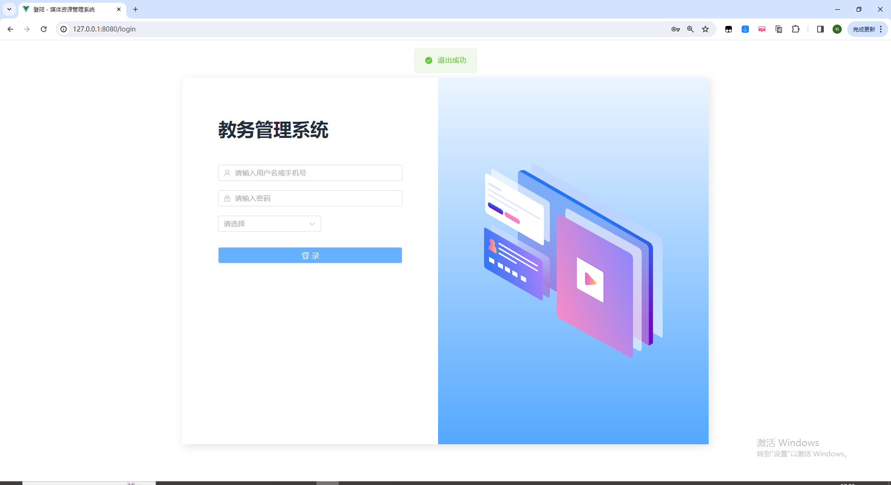

**在线购买系统**：https://ake999.com/109.html

需要代码，联系微信 python_kk或者qq：976870170（备注github，不备注不通过）

需要代码，联系微信 python_kk或者qq：976870170（备注github，不备注不通过）

需要代码，联系微信 python_kk或者qq：976870170（备注github，不备注不通过）


**在线购买系统**：https://ake999.com/109.html

一、主要技术：python、django、vue、mysql、echarts、bootstrap、jquery、css、cookie、session等基本技术实现

**系统亮点1：python框架和vue做毕设，做的人少！django开发便捷，容易毕业！！！！！！**

**系统亮点2：多角色不同页面，管理员拥有管理员页面，老师有宿管页面，学生有学生页面**

**系统亮点3：界面ui非常美观**

系统亮点4：加入审核和加入打分


 二、主要功能:

管理员功能：

```
系统首页
信息管理
学院管理
教师管理
学生管理
课程管理
开课管理
选课管理
成绩管理
通知管理
```


老师功能

```
系统首页
信息管理
学生管理
课程管理
开课管理
选课管理
成绩管理
通知消息
```


学生功能

```
系统首页
信息管理
课程管理
开课管理
选课管理
成绩管理
通知消息
```


通用功能：登录、退出、修改姓名、密码

三、用例图，数据库er图


三、管理员功能




四、老师


五、学生


代码为付费获取，请知悉
